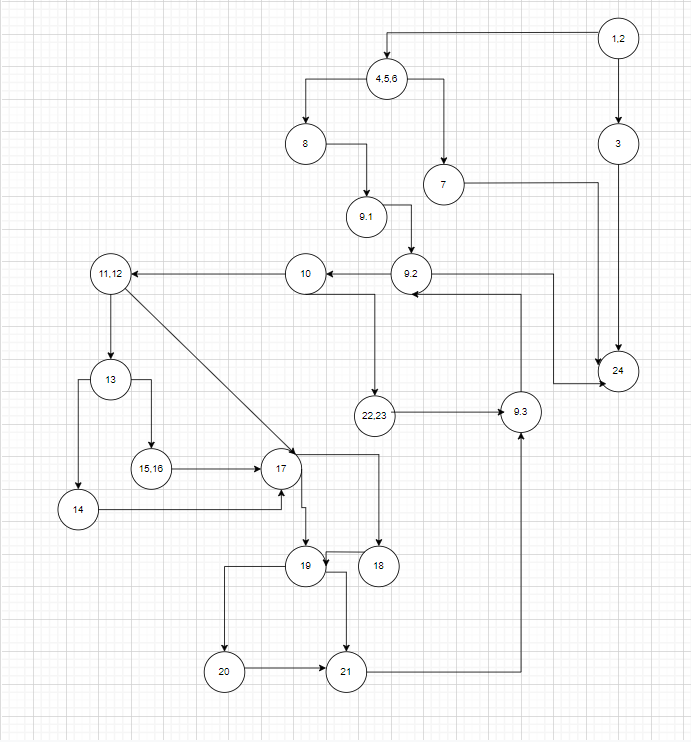
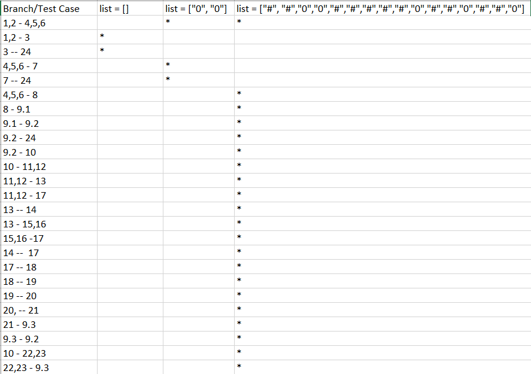

# SI_2022_lab2_202020
2. CFG

   
3.Цикломатска комплексност е
   број на региони = број на рабови - број на јазли + 2раба = 27 - 20 + 2 = 9. Цикломатска комплексност е 9

4.Тест случаи според Every statement

За празната листа при праќање се проверува големината на таа листа во if условот . Потоа се исполнува условот и со тоа ќе се фрли IllegalArgumentException("List length should be greater than 0") и од тука следува заврши извршувањето на функцијата.

Во вториот случај немаме квадратна матрица, поради тоа што должината е 2. Се фрла IllegalArgumentException("List length should be a perfect square").

Со третиот тест пример ќе се поминат сите линии код во for циклусот.

->Node 22 и 23 е делот од кодот којшто е задолжен за справување со бомбите. Кога има # значи дека има бомба, па така треба да вратиме #.

->При читање на првата нула, бидејќи се наоѓа на крајот на редот и  има бомба лево од неа, одтука следува дека се исполнува условот node 12, но нема да се исполни условот на node 13.Нулата нема да проверува дали има бомба над неа т.е нејзината горна редица затоа што се наоѓа на првата редица.

->Вчитувајќи ја втората нула, која се наоѓа во средина и е обиколено со бомби од обете страни повлекува на исполнување на условот node 13 кој укажува на тоа дека не се наожа на краевите и дека е обиколено од бомби.

5.Тест случаи според Every branch

-> При праќање на празна листа се извршува if условот кој ќе се исполни и ќе ни фрли IllegalArgumentException("List length should be greater than 0"), по што следи завршување на извршувањето на функцијата.

-> Проверувајќи го вториот случај увидуваме дека немаме квадратна матрица и се фрла IllegalArgumentException("List length should be a perfect square"). Ова е бидејќи не должината не е доволно, односно должината е 2.
 
 